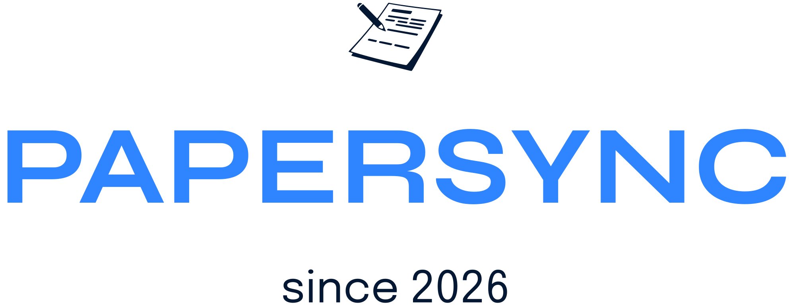

<div align="center">
  
  <p><em>Your invoices, filed automatically.</em></p>

  [](https://sonarqube.furch-services.de/dashboard?id=PaperSync)
  [](https://sonarqube.furch-services.de/dashboard?id=PaperSync)
  [](https://sonarqube.furch-services.de/dashboard?id=PaperSync)
  [](https://sonarqube.furch-services.de/dashboard?id=PaperSync)
</div>

---

Automatically syncs sent invoices from [Papierkram](https://www.papierkram.de) to [Paperless-ngx](https://github.com/paperless-ngx/paperless-ngx). Runs as a single self-hosted container behind a reverse proxy — no separate workers, no message queues.

## What it does

- Polls the Papierkram API every N minutes for sent invoices (`state: unpaid | paid | overdue | open`)
- Downloads each invoice as PDF
- Uploads it to Paperless-ngx with configurable tags, document type, and correspondent
- Prevents duplicate uploads via a local SQLite dedup table
- Provides a password-protected web dashboard for status, manual sync, dry-run, and logs

## Architecture

```
Internet → Reverse Proxy → PaperSync Container
                                    ↕                    ↕
                          Papierkram API      Paperless-ngx API
```

| Component | Role |
|---|---|
| **FastAPI + Jinja2** | Web UI and `/health` endpoint |
| **APScheduler** | Polling loop (runs inside the app container) |
| **SQLite + Alembic** | Settings, dedup table, sync logs |
| **Fernet** | Encrypted storage of API credentials |
| **itsdangerous** | CSRF protection and signed session cookies |

## Deployment

### 1. Create the shared Docker network

```bash
docker network create internal
```

### 2. Generate a secret key

```bash
python3 -c "from cryptography.fernet import Fernet; print(Fernet.generate_key().decode())"
```

### 3. Create `.env`

```bash
cp .env.example .env
```

Edit `.env` and set at minimum:

```env
SECRET_KEY=<generated-key>
APP_USERNAME=admin
APP_PASSWORD=<your-password>
```

### 4. Create `docker-compose.yml`

```yaml
services:
  papersync:
    image: ghcr.io/furch-services/papersync:latest
    restart: unless-stopped
    env_file: .env
    ports:
      - "8000:8000"
    volumes:
      - ./data:/app/data
      - ./logs:/app/logs
    networks:
      - internal

networks:
  internal:
    external: true
```

### 5. Start

```bash
docker compose up -d
```

### 6. Configure

Open the web UI, log in, and enter your Papierkram and Paperless-ngx credentials under **Einstellungen**.

## Unraid

> **Note:** The PaperSync template is currently pending review by the Unraid Community Applications team. This section will be updated once the app is available in CA.

In the meantime, you can install PaperSync on Unraid manually via the template URL:

### Manual template installation

1. In the Unraid web UI, go to **Docker** → **Add Container** → click **Template repositories** and add:
   ```
   https://raw.githubusercontent.com/furch-services/papersync/main/unraid/papersync.xml
   ```
2. Click **Save** — PaperSync now appears in the template list.
3. Select it, fill in `SECRET_KEY` and `APP_PASSWORD`, and click **Apply**.

The data and log directories are automatically created under `/mnt/user/appdata/papersync/`.

### Reverse proxy on Unraid

If you use Nginx Proxy Manager or Swag on Unraid, point a proxy host at `http://papersync:8000`. Set `APP_ENV=production` (the default) to keep the secure cookie flag active when running behind HTTPS.

## Reverse proxy

Running PaperSync behind a reverse proxy (Caddy, nginx, Traefik, etc.) is recommended for SSL termination, custom domains, and access control. The app listens on port `8000` and respects the `X-Forwarded-*` headers passed by the proxy.

## Environment variables

| Variable | Required | Default | Description |
|---|---|---|---|
| `SECRET_KEY` | ✅ | — | Fernet key — generate with `cryptography.fernet.Fernet.generate_key()` |
| `APP_USERNAME` | — | `admin` | Web UI login username |
| `APP_PASSWORD` | ✅ | — | Web UI login password |
| `DATABASE_URL` | — | `sqlite:////app/data/papersync.db` | SQLAlchemy database URL |
| `LOG_LEVEL` | — | `INFO` | Logging level (`DEBUG`, `INFO`, `WARNING`, `ERROR`) |
| `LOG_FILE` | — | `/app/logs/app.log` | Log file path inside the container |
| `APP_ENV` | — | `production` | Set to `development` to disable the secure cookie flag |

## Settings (Web UI)

All sync settings are stored in the database and configurable via `/settings`:

| Setting | Description |
|---|---|
| Papierkram API URL | Your Papierkram subdomain URL, e.g. `https://yourcompany.papierkram.de` |
| Papierkram API Key | Bearer token from Papierkram → Einstellungen → API |
| Paperless Base URL | Your Paperless-ngx instance URL |
| Paperless API Token | Token from Paperless → your user profile |
| Polling Interval | How often to check for new invoices (minutes) |
| Default Tags | Paperless tag IDs to apply (JSON array, e.g. `[5, 12]`) |
| Default Document Type | Paperless document type ID |
| Default Correspondent | Paperless correspondent ID |

## Local development

```bash
python3 -m venv .venv
source .venv/bin/activate
pip install -r requirements.txt

export SECRET_KEY=$(python3 -c "from cryptography.fernet import Fernet; print(Fernet.generate_key().decode())")
export DATABASE_URL=sqlite:///./data/papersync.db
export APP_PASSWORD=dev
mkdir -p data logs

alembic upgrade head
uvicorn app.main:app --reload
```

## Tests

```bash
pytest tests/
# With coverage:
pytest tests/ --cov=app --cov-report=term-missing
```

## Backup

All persistent data lives in `./data/`:

```bash
# Backup
cp data/papersync.db data/papersync.db.bak

# Restore (container must be stopped)
docker compose stop
cp data/papersync.db.bak data/papersync.db
docker compose up -d
```

## Troubleshooting

**No invoices synced:** Check the web UI logs. Common cause: Papierkram API key is wrong, or the invoice state doesn't match (`unpaid`, `paid`, `overdue`).

**Container won't start / permission error on logs:** The bind-mounted `./logs` directory may be owned by root. The entrypoint script fixes this automatically on startup.

**Auth errors after restart:** Session tokens are in-memory — users need to log in again after a container restart.

**`Too Many Requests` from Papierkram:** Increase the polling interval in Settings.

## Maintainer

PaperSync is developed and maintained by **[Furch Services](https://furch-services.de)** — IT-Dienstleister aus Norderstedt.

| | |
|---|---|
| **Name** | Maximilian Furch |
| **Company** | Furch Services |
| **Website** | [furch-services.de](https://furch-services.de) |
| **Contact** | [kontakt@furch-services.de](mailto:kontakt@furch-services.de) |
| **Location** | Norderstedt, Germany |

## License

[AGPL-3.0](LICENSE)
